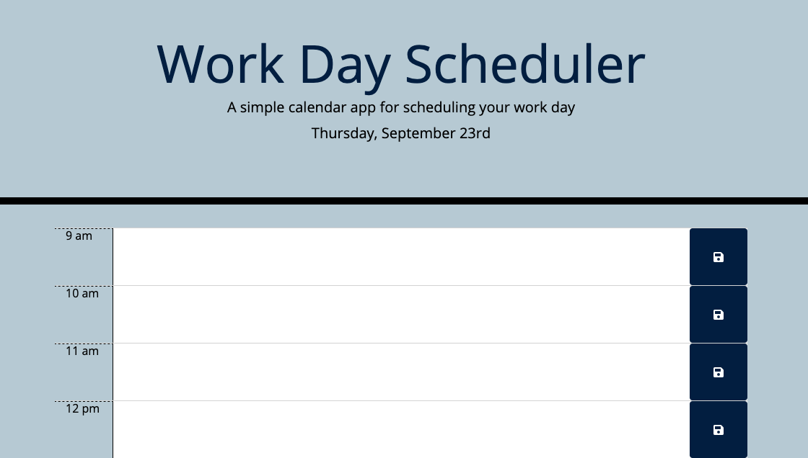

# Work-Day-Scheduler

This application is a work scheduler built with HTML, CSS, Bootstrap and JavaScript. Users can add some notes in the given time section. Users are recommend to use Google Chrome, Safari or Mozilla Firefox web browser to avoid errors.

## Live App
https://vanjungthawng.github.io/Work-Day-Scheduler/

## Mock-Up

The following image shows the apps appearance:

